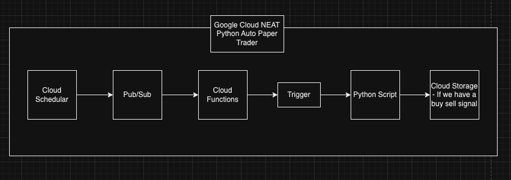
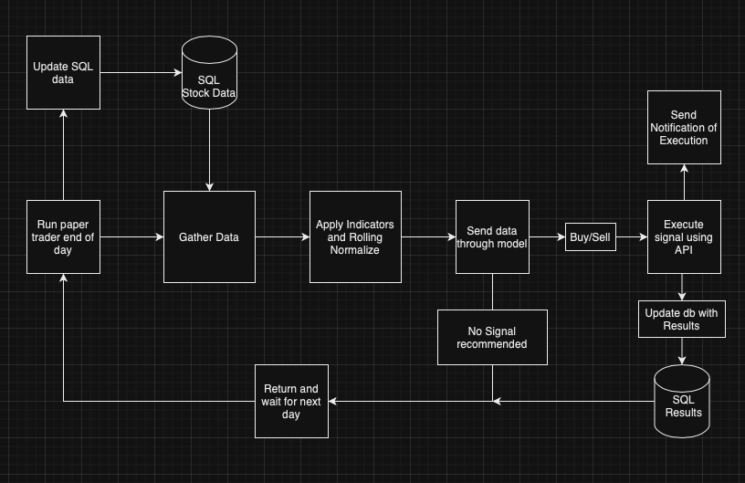
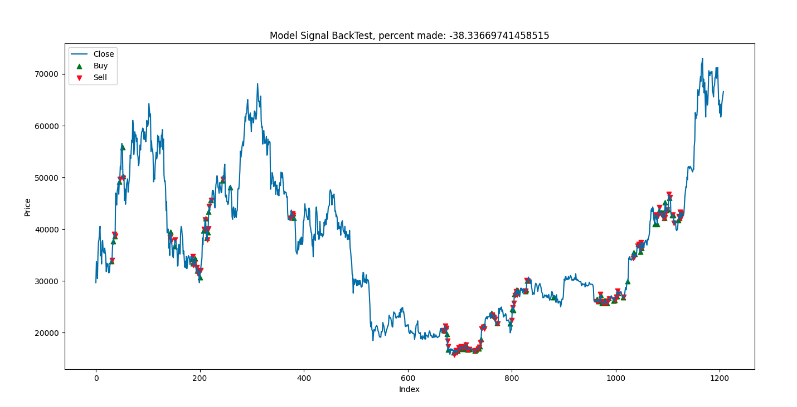

# Paper Trading Algorithm

This paper trading algorithm is designed to trade stocks and crypto in the market daily based on predictions made by neural network models. The algorithm pulls market data using the Alpaca API, processes it through trained neural network models stored in pickle files, and determines whether to buy or sell assets for that day. If a trade decision is made, the algorithm sends API requests through the Alpaca API to execute the trades.

# Features:

- Pulls market data from the Alpaca API.
- Utilizes trained neural network models stored in pickle files to make trade decisions.
- Determines whether to buy or sell assets based on the model predictions.
- Executes trades by sending API requests through the Alpaca API.
- Saves trade data to Google Cloud Storage for analysis and record-keeping.
- Utilizes the Google Cloud Scheduler to run the script daily.

# Google Cloud system architecture

# Trade Algo system architecture

# Requirements:

- Python 3.10
- Alpaca API account
- Google Cloud account

# Installation:

1. Clone the repository:

   git clone https://github.com/yourusername/paper-trading-algorithm.git

2. Install the required Python packages:

   pip install -r requirements.txt

3. Set up your Alpaca API credentials and Google Cloud Storage credentials by following the respective documentation.

4. Place your trained neural network models (stored as pickle files) in the Models directory.

5. Update the API.env file with your Alpaca API credentials, Google Cloud Storage settings, and other parameters as needed.

# model_visualizer.py Usage:

This repo also contains a model visualizer. This script is meant to show the buy and sell signals of backend data to visualize and ensure that the model is working.

# Main.py Usage:

1. Run the main script to execute the paper trading algorithm:

   python main.py

2. The script will pull market data, process it through the neural network models, make trade decisions, and execute trades as necessary.

3. Monitor the output and logs to track the algorithm's performance and executed trades.

# Configuration:

Update the configuration file (config.ini) with your settings:

- Alpaca API credentials (API key, secret key)
- Google Cloud Storage settings (bucket name, credentials file path)
- Neural network model paths
- Trade parameters (e.g., maximum allocation, risk management rules)

# Acknowledgments:

- Alpaca API documentation
- Google Cloud Storage documentation
- Google Cloud Scheduler documentation
- NEAT Python neural network training resources
